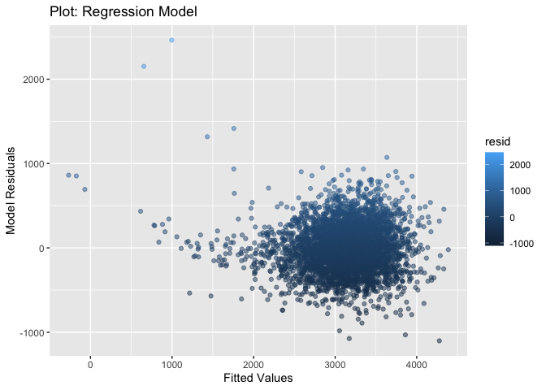
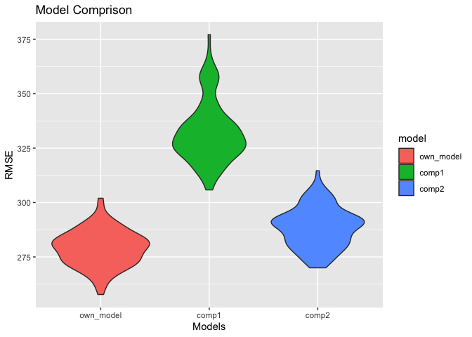

p8105_hw6_yz4187
================
Yiwen Zhao
12/4/2021

``` r
library(tidyverse)
library(modelr)
library(purrr)
```

## Problem 1

*Data cleaning:*

``` r
birthweight = read.csv("./birthweight.csv")

birthweight %>%
  janitor::clean_names() %>% 
  drop_na() %>% 
  mutate(babysex = factor(babysex, labels = c("male", "female")),
         frace = factor(frace, levels = c(1, 2, 3, 4, 8, 9),
                        labels = c("White", "Black", "Asian", "PuertoRican", "Other", "Unknown")),
         malform = factor(malform, levels = c(0, 1),
                          labels = c("absent", "present")),
         mrace = factor(mrace, levels = c(1, 2, 3, 4, 8),
                        labels = c("White", "Black", "Asian", "PuertoRican", "Other"))
         )
```

*Regression Model:*

``` r
bw_df = lm(bwt ~ smoken + wtgain + bhead + blength + mrace + gaweeks, data = birthweight)
bw_df%>% 
  broom::tidy() %>% 
  select(term, estimate, p.value) %>% 
  mutate(term = str_replace(term, "^mrace", "mom_race: ")) %>% 
  knitr::kable(digits = 3)
```

| term        |  estimate | p.value |
|:------------|----------:|--------:|
| (Intercept) | -5767.928 |       0 |
| smoken      |    -3.498 |       0 |
| wtgain      |     3.559 |       0 |
| bhead       |   135.498 |       0 |
| blength     |    77.758 |       0 |
| mom_race:   |   -68.649 |       0 |
| gaweeks     |    12.729 |       0 |

``` r
reg_model = modelr::add_residuals(birthweight, bw_df)
reg_model = modelr::add_predictions(reg_model, bw_df)
reg_model %>% 
  ggplot(aes(x = pred, y = resid, color = resid)) + 
  geom_point(alpha = .5) + 
  theme(legend.position = "right") +
  labs(
    x = "Fitted Values",
    y = "Model Residuals",
    title = "Plot: Regression Model"
  )
```

<!-- -->

*Comparison with two other models:*

``` r
bw_df1 = lm(bwt ~ blength + gaweeks, data = birthweight)
bw_df2 = lm(bwt ~ bhead + blength + babysex + bhead * blength + bhead * babysex + blength * bhead + bhead * blength * babysex, data = birthweight)

crossv = 
  crossv_mc(birthweight, 100) %>% 
  mutate(
    own_model = map(train, ~lm(bwt ~ smoken + wtgain + bhead + blength + mrace + gaweeks, data = .)),
    comp1 = map(train, ~lm(bwt ~ blength + gaweeks, data = .)),
    comp2 = map(train, ~lm(bwt ~ bhead + blength + babysex + bhead * blength + bhead * babysex + blength * bhead + bhead * blength * babysex, data = .)),
  ) %>% 
  mutate(
    rmse_own_model = map2_dbl(own_model, test, ~rmse(model = .x, data = .y)),
    rmse_comp1 = map2_dbl(comp1, test, ~rmse(model = .x, data = .y)),
    rmse_comp2 = map2_dbl(comp2, test, ~rmse(model = .x, data = .y))
  )

crossv %>% 
  select(starts_with("rmse")) %>% 
  pivot_longer(
    everything(),
    names_to = "model",
    values_to = "rmse",
    names_prefix = "rmse_"
  ) %>% 
  mutate(model = fct_inorder(model)) %>% 
  ggplot(aes(x = model, y = rmse, fill = model)) + 
  geom_violin() +
  labs(
    x = "Models",
    y = "RMSE",
    title = "Model Comprison"
  ) 
```

<!-- -->
